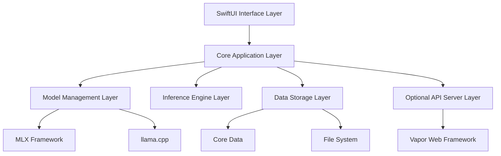

# Design Document

## Overview

ManyLLM is a native macOS application built using SwiftUI and AppKit, designed to provide a seamless interface for local LLM interaction. The application follows a modular architecture that separates concerns between UI, model management, inference processing, and data persistence. The design prioritizes performance, privacy, and user experience while maintaining extensibility for future features.

The application leverages Apple's MLX framework for optimal performance on Apple Silicon, with fallback support for llama.cpp for broader model compatibility. The architecture supports the staged development approach outlined in the requirements, allowing for incremental feature delivery.

## Architecture

### High-Level Architecture



### Technology Stack

- **UI Framework**: SwiftUI with AppKit integration for native macOS experience
- **Inference Engines**:
  - Primary: MLX (Apple's machine learning framework for Apple Silicon)
  - Secondary: llama.cpp (broader model compatibility and Intel Mac support)
- **Data Persistence**: Core Data for structured data, FileSystem for documents and models
- **API Server**: Vapor framework for optional REST API
- **Document Processing**: PDFKit, Natural Language framework, CSV parsing libraries
- **Model Downloads**: URLSession with background download support
- **Vector Database**: In-memory vector store using Accelerate framework for RAG

## Components and Interfaces

### 1. User Interface Layer

#### Main Window Layout (Based on Design Reference)

- **Purpose**: Primary application window with three-panel layout matching the provided design
- **Key Components**:
  - Left sidebar: Workspaces section (collapsible) and Files section with document list
  - Top toolbar: Model selector dropdown (e.g., "Llama 3 8B"), temperature/max token sliders, settings gear, Start button
  - Center area: Chat interface with welcome state showing ManyLLM logo and introductory message
  - Bottom input: System prompt dropdown, message input field with placeholder text and send button
- **Visual Design**: Clean, minimal interface with proper spacing, rounded corners, and macOS-native styling
- **Branding**: Incorporate the cat-bee mascot logo throughout the interface

#### ChatView

- **Purpose**: Main chat interface displaying conversation history
- **Key Components**:
  - Welcome state with ManyLLM cat-bee logo and "Welcome to ManyLLM Preview" message
  - Message list with user/assistant message bubbles
  - File context indicators showing attached documents
  - Streaming response indicators with typing animations
- **State Management**: ObservableObject pattern with Combine publishers

#### ModelBrowserView

- **Purpose**: Model discovery, download, and management interface (accessible via model dropdown)
- **Key Components**:
  - Dropdown model selector in top toolbar showing current model (e.g., "Llama 3 8B Ollama")
  - Model browser sheet/popover with searchable model list
  - Model detail views with specifications and download options
  - Download progress indicators integrated into the dropdown
  - Model status indicators (loaded/unloaded) in the selector

#### WorkspaceView (Left Sidebar)

- **Purpose**: Workspace organization and session management
- **Key Components**:
  - Collapsible "Workspaces" section with current workspace highlighted
  - Individual workspace items (e.g., "Current Chat", "Research Project", "Code Review")
  - Add workspace button (+) for creating new workspaces
  - "Files" section showing uploaded documents with file icons and sizes
  - Document context indicators (eye icons) showing which files are active
  - File count summary (e.g., "2 of 3 files in context")

#### SettingsView & Parameter Controls

- **Purpose**: Application configuration and real-time parameter adjustment
- **Key Components**:
  - Top toolbar parameter controls: Temperature slider (0-2.0), Max tokens slider (up to 600+)
  - Settings gear icon accessing full preferences panel
  - System prompt dropdown with preset options
  - Privacy indicators and local processing status
  - API server toggle and configuration (in full settings panel)

### 2. Core Application Layer

#### AppCoordinator

```swift
class AppCoordinator: ObservableObject {
    @Published var currentWorkspace: Workspace?
    @Published var activeModel: LoadedModel?
    @Published var chatSessions: [ChatSession] = []

    func switchWorkspace(_ workspace: Workspace)
    func loadModel(_ model: ModelInfo) async throws
    func sendMessage(_ content: String, documents: [Document]) async throws -> String
}
```

#### ChatManager

```swift
class ChatManager: ObservableObject {
    @Published var messages: [ChatMessage] = []
    @Published var isProcessing: Bool = false

    func sendMessage(_ content: String, context: [Document]) async throws
    func clearHistory()
    func exportSession() -> Data
}
```

### 3. Model Management Layer

#### ModelRepository

```swift
protocol ModelRepository {
    func fetchAvailableModels() async throws -> [ModelInfo]
    func downloadModel(_ model: ModelInfo) async throws
    func getLocalModels() -> [ModelInfo]
    func deleteModel(_ model: ModelInfo) throws
}
```

#### ModelLoader

```swift
protocol ModelLoader {
    func loadModel(_ path: URL) async throws -> LoadedModel
    func unloadModel(_ model: LoadedModel)
    func isModelLoaded(_ model: ModelInfo) -> Bool
}
```

#### MLXModelLoader & LlamaCppModelLoader

- Concrete implementations of ModelLoader for different inference engines
- Handle model-specific loading, memory management, and parameter validation

### 4. Inference Engine Layer

#### InferenceEngine

```swift
protocol InferenceEngine {
    func generateResponse(
        prompt: String,
        parameters: InferenceParameters,
        context: [Document]?
    ) async throws -> AsyncStream<String>
}
```

#### MLXInferenceEngine

- Leverages Apple's MLX framework for optimal Apple Silicon performance
- Handles tokenization, generation, and streaming responses
- Manages GPU memory allocation and optimization

#### LlamaCppInferenceEngine

- Fallback engine using llama.cpp for broader compatibility
- CPU-optimized inference with configurable thread usage
- Support for quantized models and memory-efficient processing

### 5. Data Storage Layer

#### WorkspaceStore

```swift
class WorkspaceStore: ObservableObject {
    func createWorkspace(_ name: String) -> Workspace
    func saveWorkspace(_ workspace: Workspace) throws
    func loadWorkspaces() -> [Workspace]
    func deleteWorkspace(_ workspace: Workspace) throws
}
```

#### DocumentProcessor

```swift
protocol DocumentProcessor {
    func processDocument(_ url: URL) async throws -> ProcessedDocument
    func extractText(_ document: ProcessedDocument) -> String
    func createEmbeddings(_ text: String) async throws -> [Float]
}
```

#### VectorStore

```swift
class VectorStore {
    func addDocument(_ document: ProcessedDocument, embeddings: [Float])
    func searchSimilar(_ query: String, limit: Int) -> [DocumentChunk]
    func clearDocuments()
}
```

### 6. API Server Layer (Optional)

#### APIServer

```swift
class APIServer {
    private let app: Application

    func start(port: Int) throws
    func stop()
    func registerRoutes()
}
```

#### Routes

- `POST /v1/chat/completions` - OpenAI-compatible chat completion endpoint
- `GET /v1/models` - List available models
- `GET /health` - Health check endpoint

## Data Models

### Core Models

```swift
struct ModelInfo: Codable, Identifiable {
    let id: String
    let name: String
    let author: String
    let description: String
    let size: Int64
    let parameters: String
    let downloadURL: URL
    let isLocal: Bool
    let isLoaded: Bool
    let compatibility: ModelCompatibility
}

struct ChatMessage: Codable, Identifiable {
    let id: UUID
    let content: String
    let role: MessageRole
    let timestamp: Date
    let metadata: MessageMetadata?
}

struct Workspace: Codable, Identifiable {
    let id: UUID
    var name: String
    var sessions: [ChatSession]
    var documents: [ProcessedDocument]
    var createdAt: Date
    var lastModified: Date
}

struct ProcessedDocument: Codable, Identifiable {
    let id: UUID
    let originalURL: URL
    let filename: String
    let content: String
    let chunks: [DocumentChunk]
    let embeddings: [Float]
    let processedAt: Date
}

struct InferenceParameters: Codable {
    var temperature: Float = 0.7
    var maxTokens: Int = 2048
    var topP: Float = 0.9
    var systemPrompt: String = ""
    var stopSequences: [String] = []
}
```

### Persistence Schema

The application uses Core Data for structured data persistence with the following entities:

- **WorkspaceEntity**: Stores workspace metadata and relationships
- **ChatSessionEntity**: Stores individual chat sessions within workspaces
- **MessageEntity**: Stores individual messages with content and metadata
- **DocumentEntity**: Stores document metadata and processing information
- **ModelEntity**: Stores local model information and preferences

## Error Handling

### Error Types

```swift
enum ManyLLMError: LocalizedError {
    case modelNotFound(String)
    case modelLoadFailed(String)
    case inferenceError(String)
    case documentProcessingFailed(String)
    case networkError(String)
    case storageError(String)
    case apiServerError(String)

    var errorDescription: String? {
        // User-friendly error messages
    }

    var recoverySuggestion: String? {
        // Actionable recovery suggestions
    }
}
```

### Error Handling Strategy

1. **Graceful Degradation**: Application continues functioning when non-critical components fail
2. **User-Friendly Messages**: Technical errors are translated to actionable user guidance
3. **Logging**: Comprehensive logging for debugging without compromising privacy
4. **Recovery Options**: Automatic retry mechanisms and manual recovery actions
5. **Validation**: Input validation at UI and API boundaries

## Testing Strategy

### Unit Testing

- **Model Management**: Test model loading, unloading, and switching logic
- **Inference Engines**: Test response generation with various parameters
- **Document Processing**: Test text extraction and embedding generation
- **Data Persistence**: Test Core Data operations and file system interactions
- **API Endpoints**: Test REST API functionality and OpenAI compatibility

### Integration Testing

- **End-to-End Chat Flow**: Test complete user interaction from prompt to response
- **Model Download and Installation**: Test model repository integration
- **Workspace Management**: Test session persistence and restoration
- **Document RAG Pipeline**: Test document upload, processing, and context integration
- **API Server Integration**: Test external application integration

### UI Testing

- **Chat Interface**: Test message display, input handling, and scrolling
- **Model Browser**: Test search, filtering, and download functionality
- **Workspace Navigation**: Test workspace switching and session management
- **Settings Configuration**: Test parameter adjustment and preference persistence

### Performance Testing

- **Memory Usage**: Monitor memory consumption during model loading and inference
- **Response Time**: Measure inference speed across different model sizes
- **Concurrent Operations**: Test multiple simultaneous operations (download + inference)
- **Large Document Processing**: Test performance with large document sets

### Privacy Testing

- **Network Isolation**: Verify no unintended network requests during inference
- **Data Persistence**: Ensure sensitive data is properly encrypted at rest
- **Memory Cleanup**: Verify sensitive data is cleared from memory after use
- **API Security**: Test API authentication and request validation

## Security Considerations

### Data Privacy

- All inference processing occurs locally without network requests
- Document content is encrypted at rest using FileVault integration
- Chat history is stored locally with user-controlled retention policies
- No telemetry or analytics data collection

### API Security

- Optional API server runs on localhost only
- Basic authentication for API access
- Rate limiting to prevent abuse
- Input validation and sanitization

### Model Security

- Model integrity verification during download
- Sandboxed model execution environment
- Resource limits to prevent system overload
- Secure model storage with access controls

## Performance Optimization

### Memory Management

- Lazy loading of chat history and documents
- Model unloading when switching between models
- Efficient vector storage with memory mapping
- Background processing for non-critical operations

### Inference Optimization

- GPU acceleration via MLX on Apple Silicon
- Quantized model support for reduced memory usage
- Streaming responses for better perceived performance
- Caching of frequently used embeddings

### UI Responsiveness

- Async/await patterns for all long-running operations
- Background queues for document processing
- Progressive loading of large chat histories
- Optimized SwiftUI view updates

This design provides a solid foundation for the ManyLLM application while maintaining flexibility for the iterative development approach outlined in the requirements.
